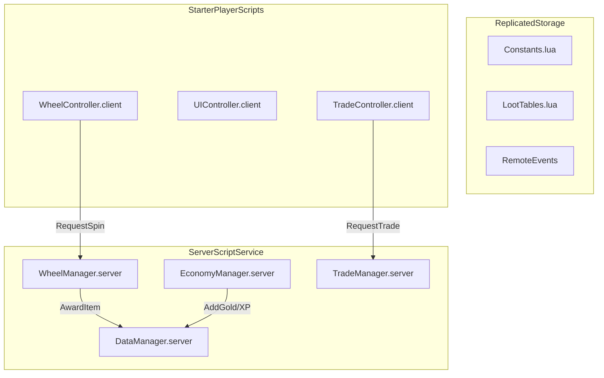

# Architecture Technique — Brainrot Wheel Royale

> Statut : BROUILLON
> Basé sur le framework de "Nouvelle base".

---

## Vue d'ensemble Client/Serveur



---

## Services Serveur (Logic)

| Service | Responsabilité |
|:--- |:--- |
| **DataManager** | Gère le `DataStoreService`, le chargement et la sauvegarde du profil (Gold, XP, Inventaire). |
| **WheelManager** | Calcule le résultat d'un spin (basé sur `LootTables.lua`), vérifie les Tickets/Or, lance les RemoteEvents de gain. |
| **EconomyManager** | Gère la conversion des objets vendus en Or/XP/Tickets. Gère les achats de tickets. |
| **TradeManager** | Gère l'état de la "Trade Machine". Vérifie que les items existent avant le transfert. |

---

## Controllers Client (Visual)

| Controller | Responsabilité |
|:--- |:--- |
| **WheelController** | Gère l'animation physique ou UI de la roue qui tourne. Déclenche les sons de "clic-clic-clic". |
| **UIController** | Gère l'affichage de l'inventaire, de l'Or, de l'XP et des notifications de rareté (Pop-ups "ULTRA !"). |
| **TradeController** | Gère l'interface de la Trade Machine et les interactions de validation (Ready/Unready). |

---

## Schéma des Données (DataStore)

```lua
PlayerData = {
    version = 1,
    stats = {
        gold = 0,
        xp = 0,
        level = 1,
        tickets = 10, -- Tickets offerts au début
    },
    inventory = {
        -- Liste des items possédés
        ["SigmaFace_01"] = { id = "SigmaFace", rarity = "Rare", count = 1 },
    },
    collection = {
        -- Historique pour les badges/bonus
        ["SigmaFace"] = true,
    }
}
```

---

## Communication (RemoteEvents)

| Event Name | Direction | Payload |
|:--- |:--- |:--- |
| `SpinRequest` | C -> S | `{ wheelId }` |
| `SpinResult` | S -> C | `{ itemId, rarity, finalAngle }` |
| `SellRequest` | C -> S | `{ inventoryItemIds[] }` |
| `TradeRequest` | C -> S | `{ targetPlayer, offeredItems[] }` |
| `UpdateClientData` | S -> C | `{ newStats, newInventory }` |

---

## Sécurité Anti-Triche
1.  **Validation Temps** : Le serveur refuse un `SpinRequest` si le cooldown (5s) n'est pas expiré.
2.  **Vérification Possession** : Le serveur vérifie que le joueur possède REELLEMENT l'item avant de le vendre ou de l'échanger.
3.  **Calcul Serveur** : Les probabilités (60/20/10/8/2) sont calculées EXCLUSIVEMENT sur le serveur. Le client ne fait que l'animation.
